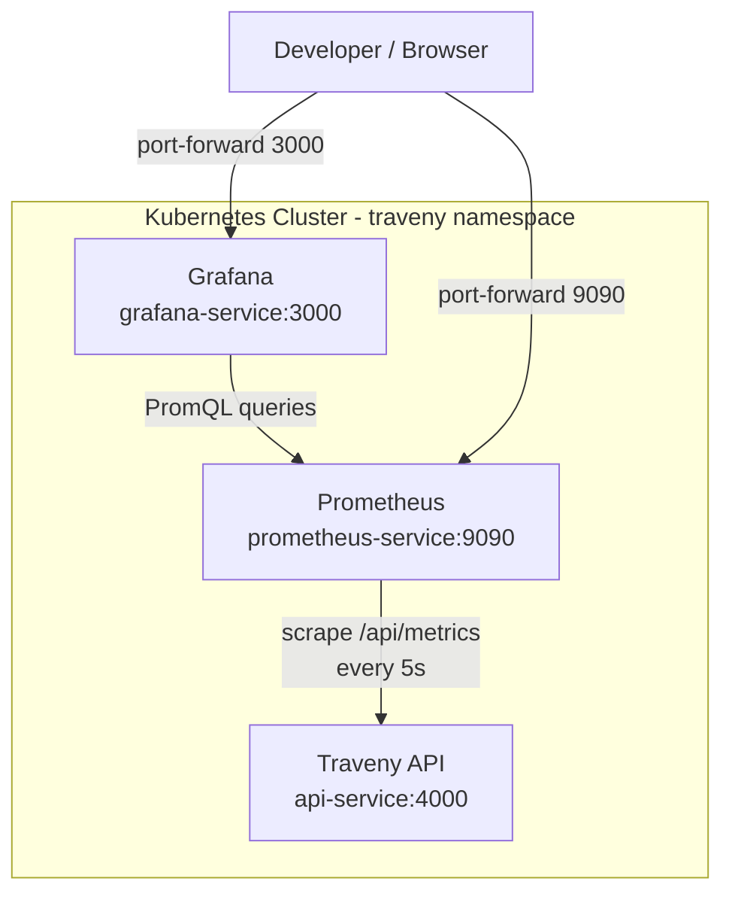

# Traveny Monitoring Stack — Architecture Guide

## Overview

The Traveny API exposes Prometheus metrics at `/api/metrics`. These metrics are scraped by a Prometheus instance running inside the Kubernetes cluster, and visualized through Grafana dashboards.

```
┌──────────────┐       scrape /api/metrics       ┌──────────────┐       datasource       ┌──────────────┐
│              │ ◄─────────────────────────────── │              │ ◄──────────────────── │              │
│  Traveny API │        every 5 seconds           │  Prometheus  │                       │   Grafana    │
│  :4000       │                                  │  :9090       │                       │   :3000      │
│              │ ──────────────────────────────► │              │ ──────────────────── │              │
└──────────────┘       returns metrics text       └──────────────┘      PromQL queries    └──────────────┘
```

## Architecture Diagram



## What Metrics Are Collected

### Default Runtime Metrics (prefix: `traveny_api_`)
Automatically collected by `prom-client`:
| Metric | Type | Description |
|--------|------|-------------|
| `traveny_api_process_cpu_user_seconds_total` | Counter | CPU time spent in user mode |
| `traveny_api_process_cpu_system_seconds_total` | Counter | CPU time spent in system mode |
| `traveny_api_process_resident_memory_bytes` | Gauge | Resident memory size (RSS) |
| `traveny_api_process_heap_bytes` | Gauge | Heap memory usage |
| `traveny_api_nodejs_eventloop_lag_seconds` | Gauge | Event loop lag |

### Custom HTTP Metrics
| Metric | Type | Labels | Description |
|--------|------|--------|-------------|
| `traveny_api_http_requests_total` | Counter | `method`, `route`, `status_code` | Total HTTP requests processed |
| `traveny_api_http_request_duration_seconds` | Histogram | `method`, `route`, `status_code` | Request duration in seconds |

## File Structure

```
apps/api/src/
├── lib/
│   ├── metrics.ts          # prom-client registry, counters, histograms
│   └── setup-api.ts        # Metrics middleware + GET /metrics endpoint
│
k8s/monitoring/
├── prometheus.yaml         # ConfigMap + Deployment + Service
└── grafana.yaml            # ConfigMap (datasource) + Deployment + Service
```

### Key Files

| File | Purpose |
|------|---------|
| [`metrics.ts`](file:///home/mahesh/Desktop/Projects_001/traveny/traveny/apps/api/src/lib/metrics.ts) | Creates the Prometheus registry, collects default runtime metrics, defines custom HTTP counters and histograms |
| [`setup-api.ts`](file:///home/mahesh/Desktop/Projects_001/traveny/traveny/apps/api/src/lib/setup-api.ts) | Registers the `/metrics` GET endpoint and the request-tracking middleware on the Hono app |
| [`prometheus.yaml`](file:///home/mahesh/Desktop/Projects_001/traveny/traveny/k8s/monitoring/prometheus.yaml) | Prometheus deployment with scrape config pointing to `api-service:4000/api/metrics` |
| [`grafana.yaml`](file:///home/mahesh/Desktop/Projects_001/traveny/traveny/k8s/monitoring/grafana.yaml) | Grafana deployment auto-provisioned with Prometheus datasource |

## How It Works

### 1. Metrics Collection (API Side)

```
Request → Metrics Middleware → Route Handler → Response
              │                                    │
              └── records method, route,           │
                  status_code, duration ───────────┘
```

- **Middleware** ([setup-api.ts:28-43](file:///home/mahesh/Desktop/Projects_001/traveny/traveny/apps/api/src/lib/setup-api.ts#L28-L43)): Wraps every request, measures duration, and increments the counter/histogram. Skips `/metrics` requests to avoid self-referencing.
- **Endpoint** ([setup-api.ts:46-49](file:///home/mahesh/Desktop/Projects_001/traveny/traveny/apps/api/src/lib/setup-api.ts#L46-L49)): `GET /api/metrics` returns all collected metrics in Prometheus text exposition format.

### 2. Scraping (Prometheus Side)

Prometheus is configured via ConfigMap to scrape the API every 5 seconds:

```yaml
scrape_configs:
  - job_name: 'traveny-api'
    metrics_path: '/api/metrics'
    static_configs:
      - targets: ['api-service.traveny.svc.cluster.local:4000']
```

### 3. Visualization (Grafana Side)

Grafana is auto-provisioned with a Prometheus datasource pointing to `http://prometheus-service.traveny.svc.cluster.local:9090`. No manual setup needed — just open Grafana and start querying.

## Deployment Commands

### Deploy the Monitoring Stack

```bash
# Apply monitoring manifests
kubectl apply -f k8s/monitoring/prometheus.yaml
kubectl apply -f k8s/monitoring/grafana.yaml

# Verify pods are running
kubectl get pods -n traveny -l 'app in (prometheus, grafana)'
```

### Rebuild and Deploy API (after code changes)

```bash
# Build inside Minikube's Docker daemon
eval $(minikube docker-env)
docker build --no-cache -f apps/api/Dockerfile -t traveny-api:latest .

# Restart the API deployment to pick up the new image
kubectl rollout restart deployment/api -n traveny
kubectl rollout status deployment/api -n traveny
```

### Access Monitoring UIs

```bash
# Prometheus UI (http://localhost:9090)
kubectl port-forward -n traveny svc/prometheus-service 9090:9090

# Grafana UI (http://localhost:3000, login: admin/admin)
kubectl port-forward -n traveny svc/grafana-service 3000:3000
```

### Verify Metrics Endpoint

```bash
# Test from inside the cluster
kubectl exec -n traveny deploy/api -- curl -s http://localhost:4000/api/metrics | head -20

# Test via port-forward
kubectl port-forward -n traveny svc/api-service 4000:4000
curl http://localhost:4000/api/metrics
```

## Metrics & Analytics Insights

When monitoring the API in Prometheus or Grafana, you can extract three key categories of operational insights:

### 1. Request Traffic & API Usage Patterns
Track incoming traffic, active endpoints, and HTTP error trends.

| Insight | PromQL Query | Description & Use Case |
|---------|--------------|------------------------|
| **Total Request Rate (RPS)** | `rate(traveny_api_http_requests_total[5m])` | Overall throughput across the API in requests per second. |
| **Error Rate (4xx / 5xx Errors)** | `sum by (status_code)(rate(traveny_api_http_requests_total{status_code=~"4..\|5.."}[5m]))` | Highlights non-existent routes (404), auth failures (401), or server crashes (500). |
| **Top Hit Routes / Endpoints** | `topk(5, sum by (route)(rate(traveny_api_http_requests_total[5m])))` | Shows which specific endpoints receive the most traffic. |

### 2. Response Speeds & Latency (SLA / UX)
Measure how fast your server processes user requests.

| Insight | PromQL Query | Description & Use Case |
|---------|--------------|------------------------|
| **p95 Latency (95th Percentile)** | `histogram_quantile(0.95, rate(traveny_api_http_request_duration_seconds_bucket[5m]))` | 95% of requests complete faster than this value (standard SLA metric). |
| **p99 Latency (Tail Latency)** | `histogram_quantile(0.99, rate(traveny_api_http_request_duration_seconds_bucket[5m]))` | Identifies extreme latency outliers experienced by users. |
| **Slowest Endpoints (p95 per Route)** | `topk(5, sum by (route)(histogram_quantile(0.95, rate(traveny_api_http_request_duration_seconds_bucket[5m]))))` | Pinpoints bottlenecked endpoints requiring optimization. |

### 3. Server System Resources & Runtime Health (Bun / Node.js)
Monitor runtime resource consumption and thread loop health.

| Insight | PromQL Query | Description & Use Case |
|---------|--------------|------------------------|
| **Memory Usage (RAM in MB)** | `traveny_api_process_resident_memory_bytes / 1024 / 1024` | Tracks RAM footprint (RSS) to detect memory leaks before OOM kills. |
| **CPU Usage Rate (%)** | `rate(traveny_api_process_cpu_user_seconds_total[5m]) * 100` | Monitors CPU core utilization percentage. |
| **Event Loop Lag** | `traveny_api_nodejs_eventloop_lag_seconds` | Measures delays in the single-threaded event loop. Values > 0.1s indicate synchronous blocking. |
| **Open File Descriptors** | `traveny_api_process_open_fds` | Tracks open sockets, files, and DB connections to prevent file handle exhaustion. |

## Grafana Dashboard Setup

Once Grafana is running (port-forward to `localhost:3000` or `localhost:3001`):

1. **Login**: `admin` / `admin`
2. **Create Dashboard**: Click **Dashboards** → **New** → **Import** / **Add Visualization**.
3. **Select Datasource**: Choose **Prometheus**.
4. Use any of the PromQL queries above in the metric query panel.

## Troubleshooting

### Issue 1: Metrics endpoint returns 404 (most common)

**Symptoms:** `GET /api/metrics` returns `{"message":"Not Found - /api/metrics"}` inside the cluster, but works locally with `bun run dev`.

**Root Cause:** The Dockerfile uses `bun build --minify` to bundle the API into a single `server.js`. Libraries that rely on Node.js native APIs (like `prom-client` using `perf_hooks` and `process` internals) **break silently when bundled** by Bun's bundler. The module loads but can't produce metrics, causing the route handler to fail.

**Debug Steps:**

```bash
# 1. Check if prom-client is installed in the running container
kubectl exec -n traveny deploy/api -- ls node_modules/prom-client/package.json

# 2. Test if prom-client actually loads at runtime
kubectl exec -n traveny deploy/api -- bun -e "
  try {
    const pc = require('prom-client');
    console.log('✅ prom-client loaded:', typeof pc.register);
  } catch(e) {
    console.log('❌ ERROR:', e.message);
  }
"

# 3. Test the metrics endpoint directly inside the pod
kubectl exec -n traveny deploy/api -- bun -e "
  fetch('http://localhost:4000/api/metrics')
    .then(r => { console.log('Status:', r.status); return r.text(); })
    .then(t => console.log(t.substring(0, 500)))
"
```

**Fix:** Ensure `prom-client` is externalized in the Dockerfile:

```dockerfile
# Builder stage — do NOT bundle prom-client
RUN bun build apps/api/server.ts \
  --outfile dist/server.js \
  --target bun \
  --minify \
  --external prom-client   # ← Critical!

# Runner stage — install it as a runtime dependency
RUN bun add prom-client     # ← Must install at runtime
```

> **Rule of thumb:** Any npm package that uses Node.js native C++ bindings or `perf_hooks`, `worker_threads`, `child_process` etc. must be added to `--external` and installed in the runner stage.

---

### Issue 2: Pod running stale/old Docker image

**Symptoms:** You rebuilt the Docker image but the pod still runs old code. `server.js` has an old timestamp. `prom-client` is missing from `node_modules` despite being added to the Dockerfile.

**Root Cause:** Two possible causes:
- **Wrong image name:** The local build tags the image as `traveny-api:latest` but the K8s deployment pulls `ghcr.io/maheshkmp/traveny/api:latest` from GitHub Container Registry.
- **Wrong imagePullPolicy:** `imagePullPolicy: Always` pulls from the remote registry, ignoring Minikube's local Docker daemon.

**Debug Steps:**

```bash
# 1. Check what image the pod is actually using
kubectl describe pod -n traveny -l app=api | grep -A2 "Image:"

# 2. Check the timestamp of files inside the running container
kubectl exec -n traveny deploy/api -- ls -la server.js

# 3. Compare the image ID in Minikube's Docker daemon
eval $(minikube docker-env) && docker images | grep traveny

# 4. Verify the image IDs match
kubectl get pod -n traveny -l app=api -o jsonpath='{.items[0].status.containerStatuses[0].imageID}'
```

**Fix:**

```bash
# Tag the locally built image with the correct registry name
eval $(minikube docker-env)
docker tag traveny-api:latest ghcr.io/maheshkmp/traveny/api:latest

# For local Minikube development, set imagePullPolicy to Never in k8s/api.yaml:
#   imagePullPolicy: Never
# Then re-apply:
kubectl apply -f k8s/api.yaml
```

> **⚠️ Remember:** Change `imagePullPolicy` back to `Always` before deploying to production with pushed images.

---

### Issue 3: Prometheus target shows "down"

**Symptoms:** Prometheus UI (Status → Targets) shows the `traveny-api` target as `DOWN` with a connection error.

**Debug Steps:**

```bash
# 1. Check that the API pod is running
kubectl get pods -n traveny -l app=api

# 2. Verify the API service endpoint resolves inside the cluster
kubectl exec -n traveny deploy/prometheus -- wget -q -O- \
  http://api-service.traveny.svc.cluster.local:4000/api/metrics 2>&1 | head -5

# 3. Check the Prometheus config is correct
kubectl get configmap prometheus-config -n traveny -o yaml

# 4. Check Prometheus logs for scrape errors
kubectl logs -n traveny deploy/prometheus --tail=20

# 5. Verify the API service has endpoints
kubectl get endpoints api-service -n traveny
```

**Common Causes:**
| Symptom | Cause | Fix |
|---------|-------|-----|
| `connection refused` | API pod not running or crashed | Check `kubectl logs -n traveny deploy/api` |
| `no such host` | Service DNS not resolving | Verify service name in `prometheus.yaml` matches `api-service` |
| `404 Not Found` | Metrics endpoint not registered | See Issue 1 above |
| `context deadline exceeded` | Scrape timeout too low | Increase `scrape_timeout` in prometheus config |

---

### Issue 4: Grafana shows "No data"

**Symptoms:** Grafana dashboard panels show "No data" even though Prometheus is scraping.

**Debug Steps:**

```bash
# 1. Verify Prometheus is scraping successfully
kubectl exec -n traveny deploy/prometheus -- wget -q -O- \
  'http://localhost:9090/api/v1/targets' 2>&1 | grep '"health"'
# Should show: "health":"up"

# 2. Test a simple PromQL query directly against Prometheus
kubectl exec -n traveny deploy/prometheus -- wget -q -O- \
  'http://localhost:9090/api/v1/query?query=up' 2>&1

# 3. Verify Grafana's datasource config
kubectl get configmap grafana-datasources -n traveny -o yaml
# URL should be: http://prometheus-service.traveny.svc.cluster.local:9090

# 4. Test Grafana → Prometheus connectivity
kubectl exec -n traveny deploy/grafana -- wget -q -O- \
  http://prometheus-service.traveny.svc.cluster.local:9090/api/v1/query?query=up 2>&1
```

**Common Causes:**
| Symptom | Cause | Fix |
|---------|-------|-----|
| Datasource test fails | Wrong Prometheus URL | Update `grafana.yaml` ConfigMap with correct service URL |
| Query returns empty | Wrong metric name | Check exact metric names at `/api/metrics` — all prefixed with `traveny_api_` |
| Time range shows no data | Dashboard time range too narrow | Switch to "Last 15 minutes" or "Last 1 hour" |
| Grafana just started | Not enough data collected yet | Wait 1-2 minutes for Prometheus to accumulate scrapes |

---

### Issue 5: Metrics middleware causes errors or high latency

**Symptoms:** API requests become slow, or errors appear in logs related to metrics recording.

**Debug Steps:**

```bash
# 1. Check API error logs
kubectl logs -n traveny deploy/api --tail=50 | grep -i error

# 2. Check if metrics collection itself is slow
kubectl exec -n traveny deploy/api -- bun -e "
  const start = Date.now();
  fetch('http://localhost:4000/api/metrics')
    .then(r => r.text())
    .then(() => console.log('Metrics response time:', Date.now() - start, 'ms'))
"

# 3. Check cardinality (too many unique label combinations)
kubectl exec -n traveny deploy/api -- bun -e "
  fetch('http://localhost:4000/api/metrics')
    .then(r => r.text())
    .then(t => {
      const lines = t.split('\n').filter(l => !l.startsWith('#') && l.length > 0);
      console.log('Total metric series:', lines.length);
    })
"
```

**Fix:** If cardinality is high (>1000 series), review the route labels in `setup-api.ts`. Avoid using raw `c.req.path` (which includes IDs like `/users/abc123`) — prefer matched route patterns like `/users/:id`.

---

### Quick Health Check Script

Run this to verify the entire monitoring stack in one go:

```bash
echo "=== 1. API Pod ==="
kubectl get pods -n traveny -l app=api -o wide

echo -e "\n=== 2. Metrics Endpoint ==="
kubectl exec -n traveny deploy/api -- bun -e "
  fetch('http://localhost:4000/api/metrics')
    .then(r => console.log('Status:', r.status))
    .catch(e => console.log('ERROR:', e.message))
"

echo -e "\n=== 3. Prometheus Target ==="
kubectl exec -n traveny deploy/prometheus -- wget -q -O- \
  'http://localhost:9090/api/v1/targets' 2>&1 | grep -o '"health":"[^"]*"'

echo -e "\n=== 4. Grafana Datasource ==="
kubectl exec -n traveny deploy/grafana -- wget -q -O- \
  http://prometheus-service.traveny.svc.cluster.local:9090/api/v1/query?query=up 2>&1 | grep -o '"status":"[^"]*"'

echo -e "\n=== 5. All Monitoring Pods ==="
kubectl get pods -n traveny -l 'app in (api, prometheus, grafana)'
```

Expected output: all statuses `200`/`success`/`up`, all pods `Running`.

